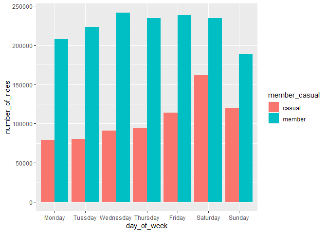
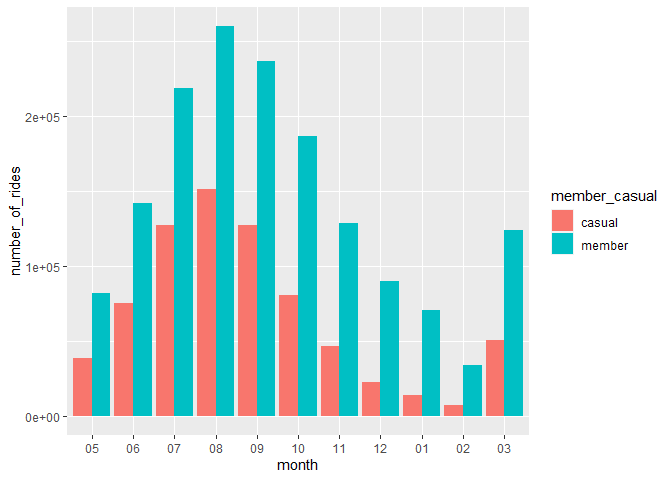
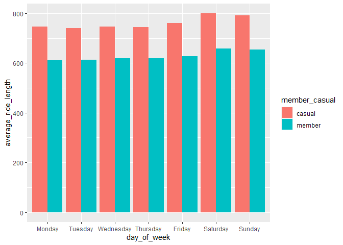
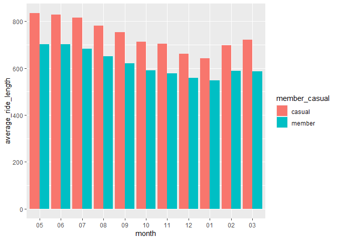
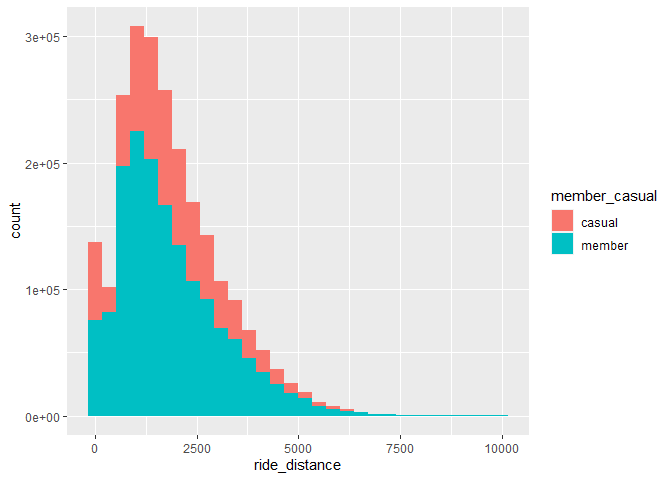
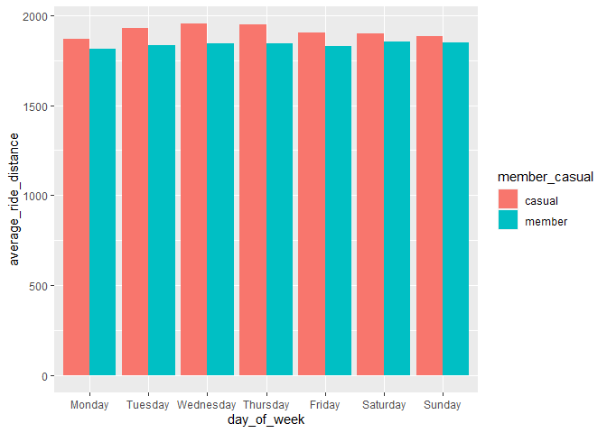
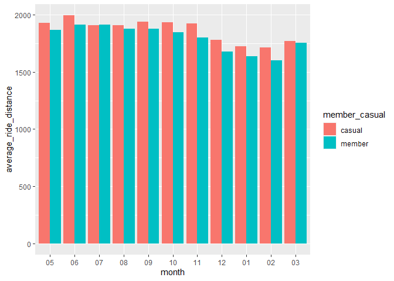

Case Study 1: How Does a Bike Share Navigate Speedy Success?
================

## Background

### Scenario

You are a junior data analyst working in the marketing analyst team at
Cyclistic, a bike-share company in Chicago. The director of marketing
believes the company’s future success depends on maximizing the number
of annual memberships. Therefore, your team wants to understand how
casual riders and annual members use Cyclistic bikes differently. From
these insights, your team will design a new marketing strategy to
convert casual riders into annual members. But first, Cyclistic
executives must approve your recommendations, so they must be backed up
with compelling data insights and professional data visualizations.

### Characters and teams

- **Cyclistic:** A bike-share program that features more than 5,800
  bicycles and 600 docking stations. Cyclistic sets itself apart by also
  offering reclining bikes, hand tricycles, and cargo bikes, making
  bike-share more inclusive to people with disabilities and riders who
  can’t use a standard two-wheeled bike. The majority of riders opt for
  traditional bikes; about 8% of riders use the assistive options.
  Cyclistic users are more likely to ride for leisure, but about 30% use
  them to commute to work each day.

- **Lily Moreno:** The director of marketing and your manager. Moreno is
  responsible for the development of campaigns and initiatives to
  promote the bike-share program. These may include email, social media,
  and other channels.

- **Cyclistic marketing analytics team:** A team of data analysts who
  are responsible for collecting, analyzing, and reporting data that
  helps guide Cyclistic marketing strategy. You joined this team six
  months ago and have been busy learning about Cyclistic’s mission and
  business goals — as well as how you, as a junior data analyst, can
  help Cyclistic achieve them.

- **Cyclistic executive team:** The notoriously detail-oriented
  executive team will decide whether to approve the recommended
  marketing program.

### About the company

In 2016, Cyclistic launched a successful bike-share offering. Since
then, the program has grown to a fleet of 5,824 bicycles that are
geotracked and locked into a network of 692 stations across Chicago. The
bikes can be unlocked from one station and returned to any other station
in the system anytime.

Until now, Cyclistic’s marketing strategy relied on building general
awareness and appealing to broad consumer segments. One approach that
helped make these things possible was the flexibility of its pricing
plans: single-ride passes, full-day passes, and annual memberships.
Customers who purchase single-ride or full-day passes are referred to as
casual riders. Customers who purchase annual memberships are Cyclistic
members.

Cyclistic’s finance analysts have concluded that annual members are much
more profitable than casual riders. Although the pricing flexibility
helps Cyclistic attract more customers, Moreno believes that maximizing
the number of annual members will be key to future growth. Rather than
creating a marketing campaign that targets all-new customers, Moreno
believes there is a very good chance to convert casual riders into
members. She notes that casual riders are already aware of the Cyclistic
program and have chosen Cyclistic for their mobility needs.

## Goal of the Case Study

Three questions will guide the future marketing program: 1. How do
annual members and casual riders use Cyclistic bikes differently? 2. Why
would casual riders buy Cyclistic annual memberships? 3. How can
Cyclistic use digital media to influence casual riders to become
members?

The question assigned for us to answer is: How do annual members and
casual riders use Cyclistic bikes differently?

We will produce a report with the following deliverables: 1. A clear
statement of the business task 2. A description of all data sources used
3. Documentation of any cleaning or manipulation of data 4. A summary of
your analysis 5. Supporting visualizations and key findings 6. Your top
three recommendations based on your analysis

## The Steps Of Analysis

### Ask Phase

#### 1. Business Task

The main business task is to convert casual riders into annual members.
Our part of the business task as a data analyst, is to find trends and
patterns in casual riders and annual members to find out what is
different between them and identify casual riders that can potentially
become annual members.

#### 2. Key Stakeholders

There are three main stakeholders in this case study, which are: 1. Lily
Moreno - The director of marketing 2. Cyclistic marketing analytics team
3. Cyclistic executive team

#### 3. Stakeholder Expectations

Design marketing strategies aimed at converting casual riders into
annual members. In order to do that, however, the marketing analyst team
needs to better understand how annual members and casual riders differ,
why casual riders would buy a membership, and how digital media could
affect their marketing tactics. The marketing team is interested in
analyzing the Cyclistic historical bike trip data to identify trends.

### Prepare Phase

#### 1. Download data and store it appropriately.

Data was dowloaded from [this
link](https://divvy-tripdata.s3.amazonaws.com/index.html).

#### 2. Identify how it is organized.

Check for data types in the data used for analysis.

#### 3. Sort and Filter Data.

Use appropriate filters and sorting methods to check credibility of
data.

#### 4. ROCCC Check

Check Credibility and Bias in data. \* Sampling bias \* Observer bias \*
Interpretation bias \* Confirmation bias

#### Load Required Packages

``` r
library(tidyverse)  #helps wrangle data
```

    ## ── Attaching core tidyverse packages ──────────────────────── tidyverse 2.0.0 ──
    ## ✔ dplyr     1.1.4     ✔ readr     2.1.4
    ## ✔ forcats   1.0.0     ✔ stringr   1.5.1
    ## ✔ ggplot2   3.4.4     ✔ tibble    3.2.1
    ## ✔ lubridate 1.9.3     ✔ tidyr     1.3.0
    ## ✔ purrr     1.0.2     
    ## ── Conflicts ────────────────────────────────────────── tidyverse_conflicts() ──
    ## ✖ dplyr::filter() masks stats::filter()
    ## ✖ dplyr::lag()    masks stats::lag()
    ## ℹ Use the conflicted package (<http://conflicted.r-lib.org/>) to force all conflicts to become errors

``` r
library(lubridate)  #helps wrangle date attributes
library(ggplot2)    #helps visualize data
library(dplyr)      #helps clean data
library(tidyr)      #helps clean data
library(geosphere)  #for spherical trigonometry

# Installed these packages using install.packages() function if not installed
```

#### Import Datasets for analysis of previous 12 month data

``` r
tripdata_2020_04 <- read.csv("../Case Study 1 - Bike Membership/202004-divvy-tripdata.csv")
tripdata_2020_05 <- read.csv("../Case Study 1 - Bike Membership/202005-divvy-tripdata.csv")
tripdata_2020_06 <- read.csv("../Case Study 1 - Bike Membership/202006-divvy-tripdata.csv")
tripdata_2020_07 <- read.csv("../Case Study 1 - Bike Membership/202007-divvy-tripdata.csv")
tripdata_2020_08 <- read.csv("../Case Study 1 - Bike Membership/202008-divvy-tripdata.csv")
tripdata_2020_09 <- read.csv("../Case Study 1 - Bike Membership/202009-divvy-tripdata.csv")
tripdata_2020_10 <- read.csv("../Case Study 1 - Bike Membership/202010-divvy-tripdata.csv")
tripdata_2020_11 <- read.csv("../Case Study 1 - Bike Membership/202011-divvy-tripdata.csv")
tripdata_2020_12 <- read.csv("../Case Study 1 - Bike Membership/202012-divvy-tripdata.csv")
tripdata_2021_01 <- read.csv("../Case Study 1 - Bike Membership/202101-divvy-tripdata.csv")
tripdata_2021_02 <- read.csv("../Case Study 1 - Bike Membership/202102-divvy-tripdata.csv")
tripdata_2021_03 <- read.csv("../Case Study 1 - Bike Membership/202103-divvy-tripdata.csv")
```

#### Check Column Names

``` r
colnames(tripdata_2020_04)
```

    ##  [1] "ride_id"            "rideable_type"      "started_at"        
    ##  [4] "ended_at"           "start_station_name" "start_station_id"  
    ##  [7] "end_station_name"   "end_station_id"     "start_lat"         
    ## [10] "start_lng"          "end_lat"            "end_lng"           
    ## [13] "member_casual"

``` r
colnames(tripdata_2020_05)
```

    ##  [1] "ride_id"            "rideable_type"      "started_at"        
    ##  [4] "ended_at"           "start_station_name" "start_station_id"  
    ##  [7] "end_station_name"   "end_station_id"     "start_lat"         
    ## [10] "start_lng"          "end_lat"            "end_lng"           
    ## [13] "member_casual"

``` r
colnames(tripdata_2020_06)
```

    ##  [1] "ride_id"            "rideable_type"      "started_at"        
    ##  [4] "ended_at"           "start_station_name" "start_station_id"  
    ##  [7] "end_station_name"   "end_station_id"     "start_lat"         
    ## [10] "start_lng"          "end_lat"            "end_lng"           
    ## [13] "member_casual"

``` r
colnames(tripdata_2020_07)
```

    ##  [1] "ride_id"            "rideable_type"      "started_at"        
    ##  [4] "ended_at"           "start_station_name" "start_station_id"  
    ##  [7] "end_station_name"   "end_station_id"     "start_lat"         
    ## [10] "start_lng"          "end_lat"            "end_lng"           
    ## [13] "member_casual"

``` r
colnames(tripdata_2020_08)
```

    ##  [1] "ride_id"            "rideable_type"      "started_at"        
    ##  [4] "ended_at"           "start_station_name" "start_station_id"  
    ##  [7] "end_station_name"   "end_station_id"     "start_lat"         
    ## [10] "start_lng"          "end_lat"            "end_lng"           
    ## [13] "member_casual"

``` r
colnames(tripdata_2020_09)
```

    ##  [1] "ride_id"            "rideable_type"      "started_at"        
    ##  [4] "ended_at"           "start_station_name" "start_station_id"  
    ##  [7] "end_station_name"   "end_station_id"     "start_lat"         
    ## [10] "start_lng"          "end_lat"            "end_lng"           
    ## [13] "member_casual"

``` r
colnames(tripdata_2020_10)
```

    ##  [1] "ride_id"            "rideable_type"      "started_at"        
    ##  [4] "ended_at"           "start_station_name" "start_station_id"  
    ##  [7] "end_station_name"   "end_station_id"     "start_lat"         
    ## [10] "start_lng"          "end_lat"            "end_lng"           
    ## [13] "member_casual"

``` r
colnames(tripdata_2020_11)
```

    ##  [1] "ride_id"            "rideable_type"      "started_at"        
    ##  [4] "ended_at"           "start_station_name" "start_station_id"  
    ##  [7] "end_station_name"   "end_station_id"     "start_lat"         
    ## [10] "start_lng"          "end_lat"            "end_lng"           
    ## [13] "member_casual"

``` r
colnames(tripdata_2020_12)
```

    ##  [1] "ride_id"            "rideable_type"      "started_at"        
    ##  [4] "ended_at"           "start_station_name" "start_station_id"  
    ##  [7] "end_station_name"   "end_station_id"     "start_lat"         
    ## [10] "start_lng"          "end_lat"            "end_lng"           
    ## [13] "member_casual"

``` r
colnames(tripdata_2021_01)
```

    ##  [1] "ride_id"            "rideable_type"      "started_at"        
    ##  [4] "ended_at"           "start_station_name" "start_station_id"  
    ##  [7] "end_station_name"   "end_station_id"     "start_lat"         
    ## [10] "start_lng"          "end_lat"            "end_lng"           
    ## [13] "member_casual"

``` r
colnames(tripdata_2021_02)
```

    ##  [1] "ride_id"            "rideable_type"      "started_at"        
    ##  [4] "ended_at"           "start_station_name" "start_station_id"  
    ##  [7] "end_station_name"   "end_station_id"     "start_lat"         
    ## [10] "start_lng"          "end_lat"            "end_lng"           
    ## [13] "member_casual"

``` r
colnames(tripdata_2021_03)
```

    ##  [1] "ride_id"            "rideable_type"      "started_at"        
    ##  [4] "ended_at"           "start_station_name" "start_station_id"  
    ##  [7] "end_station_name"   "end_station_id"     "start_lat"         
    ## [10] "start_lng"          "end_lat"            "end_lng"           
    ## [13] "member_casual"

``` r
# Confirmed none of column name should be changed
```

#### Check Data types

``` r
str(tripdata_2020_04)
```

    ## 'data.frame':    84776 obs. of  13 variables:
    ##  $ ride_id           : chr  "A847FADBBC638E45" "5405B80E996FF60D" "5DD24A79A4E006F4" "2A59BBDF5CDBA725" ...
    ##  $ rideable_type     : chr  "docked_bike" "docked_bike" "docked_bike" "docked_bike" ...
    ##  $ started_at        : chr  "2020-04-26 17:45:14" "2020-04-17 17:08:54" "2020-04-01 17:54:13" "2020-04-07 12:50:19" ...
    ##  $ ended_at          : chr  "2020-04-26 18:12:03" "2020-04-17 17:17:03" "2020-04-01 18:08:36" "2020-04-07 13:02:31" ...
    ##  $ start_station_name: chr  "Eckhart Park" "Drake Ave & Fullerton Ave" "McClurg Ct & Erie St" "California Ave & Division St" ...
    ##  $ start_station_id  : int  86 503 142 216 125 173 35 434 627 377 ...
    ##  $ end_station_name  : chr  "Lincoln Ave & Diversey Pkwy" "Kosciuszko Park" "Indiana Ave & Roosevelt Rd" "Wood St & Augusta Blvd" ...
    ##  $ end_station_id    : int  152 499 255 657 323 35 635 382 359 508 ...
    ##  $ start_lat         : num  41.9 41.9 41.9 41.9 41.9 ...
    ##  $ start_lng         : num  -87.7 -87.7 -87.6 -87.7 -87.6 ...
    ##  $ end_lat           : num  41.9 41.9 41.9 41.9 42 ...
    ##  $ end_lng           : num  -87.7 -87.7 -87.6 -87.7 -87.7 ...
    ##  $ member_casual     : chr  "member" "member" "member" "member" ...

``` r
str(tripdata_2020_05)
```

    ## 'data.frame':    200274 obs. of  13 variables:
    ##  $ ride_id           : chr  "02668AD35674B983" "7A50CCAF1EDDB28F" "2FFCDFDB91FE9A52" "58991CF1DB75BA84" ...
    ##  $ rideable_type     : chr  "docked_bike" "docked_bike" "docked_bike" "docked_bike" ...
    ##  $ started_at        : chr  "2020-05-27 10:03:52" "2020-05-25 10:47:11" "2020-05-02 14:11:03" "2020-05-02 16:25:36" ...
    ##  $ ended_at          : chr  "2020-05-27 10:16:49" "2020-05-25 11:05:40" "2020-05-02 15:48:21" "2020-05-02 16:39:28" ...
    ##  $ start_station_name: chr  "Franklin St & Jackson Blvd" "Clark St & Wrightwood Ave" "Kedzie Ave & Milwaukee Ave" "Clarendon Ave & Leland Ave" ...
    ##  $ start_station_id  : int  36 340 260 251 261 206 261 180 331 219 ...
    ##  $ end_station_name  : chr  "Wabash Ave & Grand Ave" "Clark St & Leland Ave" "Kedzie Ave & Milwaukee Ave" "Lake Shore Dr & Wellington Ave" ...
    ##  $ end_station_id    : int  199 326 260 157 206 22 261 180 300 305 ...
    ##  $ start_lat         : num  41.9 41.9 41.9 42 41.9 ...
    ##  $ start_lng         : num  -87.6 -87.6 -87.7 -87.7 -87.7 ...
    ##  $ end_lat           : num  41.9 42 41.9 41.9 41.8 ...
    ##  $ end_lng           : num  -87.6 -87.7 -87.7 -87.6 -87.6 ...
    ##  $ member_casual     : chr  "member" "casual" "casual" "casual" ...

``` r
str(tripdata_2020_06)
```

    ## 'data.frame':    343005 obs. of  13 variables:
    ##  $ ride_id           : chr  "8CD5DE2C2B6C4CFC" "9A191EB2C751D85D" "F37D14B0B5659BCF" "C41237B506E85FA1" ...
    ##  $ rideable_type     : chr  "docked_bike" "docked_bike" "docked_bike" "docked_bike" ...
    ##  $ started_at        : chr  "2020-06-13 23:24:48" "2020-06-26 07:26:10" "2020-06-23 17:12:41" "2020-06-20 01:09:35" ...
    ##  $ ended_at          : chr  "2020-06-13 23:36:55" "2020-06-26 07:31:58" "2020-06-23 17:21:14" "2020-06-20 01:28:24" ...
    ##  $ start_station_name: chr  "Wilton Ave & Belmont Ave" "Federal St & Polk St" "Daley Center Plaza" "Broadway & Cornelia Ave" ...
    ##  $ start_station_id  : int  117 41 81 303 327 327 41 115 338 84 ...
    ##  $ end_station_name  : chr  "Damen Ave & Clybourn Ave" "Daley Center Plaza" "State St & Harrison St" "Broadway & Berwyn Ave" ...
    ##  $ end_station_id    : int  163 81 5 294 117 117 81 303 164 53 ...
    ##  $ start_lat         : num  41.9 41.9 41.9 41.9 41.9 ...
    ##  $ start_lng         : num  -87.7 -87.6 -87.6 -87.6 -87.7 ...
    ##  $ end_lat           : num  41.9 41.9 41.9 42 41.9 ...
    ##  $ end_lng           : num  -87.7 -87.6 -87.6 -87.7 -87.7 ...
    ##  $ member_casual     : chr  "casual" "member" "member" "casual" ...

``` r
str(tripdata_2020_07)
```

    ## 'data.frame':    551480 obs. of  13 variables:
    ##  $ ride_id           : chr  "762198876D69004D" "BEC9C9FBA0D4CF1B" "D2FD8EA432C77EC1" "54AE594E20B35881" ...
    ##  $ rideable_type     : chr  "docked_bike" "docked_bike" "docked_bike" "docked_bike" ...
    ##  $ started_at        : chr  "2020-07-09 15:22:02" "2020-07-24 23:56:30" "2020-07-08 19:49:07" "2020-07-17 19:06:42" ...
    ##  $ ended_at          : chr  "2020-07-09 15:25:52" "2020-07-25 00:20:17" "2020-07-08 19:56:22" "2020-07-17 19:27:38" ...
    ##  $ start_station_name: chr  "Ritchie Ct & Banks St" "Halsted St & Roscoe St" "Lake Shore Dr & Diversey Pkwy" "LaSalle St & Illinois St" ...
    ##  $ start_station_id  : int  180 299 329 181 268 635 113 211 176 31 ...
    ##  $ end_station_name  : chr  "Wells St & Evergreen Ave" "Broadway & Ridge Ave" "Clark St & Wellington Ave" "Clark St & Armitage Ave" ...
    ##  $ end_station_id    : int  291 461 156 94 301 289 140 31 191 142 ...
    ##  $ start_lat         : num  41.9 41.9 41.9 41.9 41.9 ...
    ##  $ start_lng         : num  -87.6 -87.6 -87.6 -87.6 -87.6 ...
    ##  $ end_lat           : num  41.9 42 41.9 41.9 41.9 ...
    ##  $ end_lng           : num  -87.6 -87.7 -87.6 -87.6 -87.6 ...
    ##  $ member_casual     : chr  "member" "member" "casual" "casual" ...

``` r
str(tripdata_2020_08)
```

    ## 'data.frame':    622361 obs. of  13 variables:
    ##  $ ride_id           : chr  "322BD23D287743ED" "2A3AEF1AB9054D8B" "67DC1D133E8B5816" "C79FBBD412E578A7" ...
    ##  $ rideable_type     : chr  "docked_bike" "electric_bike" "electric_bike" "electric_bike" ...
    ##  $ started_at        : chr  "2020-08-20 18:08:14" "2020-08-27 18:46:04" "2020-08-26 19:44:14" "2020-08-27 12:05:41" ...
    ##  $ ended_at          : chr  "2020-08-20 18:17:51" "2020-08-27 19:54:51" "2020-08-26 21:53:07" "2020-08-27 12:53:45" ...
    ##  $ start_station_name: chr  "Lake Shore Dr & Diversey Pkwy" "Michigan Ave & 14th St" "Columbus Dr & Randolph St" "Daley Center Plaza" ...
    ##  $ start_station_id  : int  329 168 195 81 658 658 196 67 153 177 ...
    ##  $ end_station_name  : chr  "Clark St & Lincoln Ave" "Michigan Ave & 14th St" "State St & Randolph St" "State St & Kinzie St" ...
    ##  $ end_station_id    : int  141 168 44 47 658 658 49 229 225 305 ...
    ##  $ start_lat         : num  41.9 41.9 41.9 41.9 41.9 ...
    ##  $ start_lng         : num  -87.6 -87.6 -87.6 -87.6 -87.7 ...
    ##  $ end_lat           : num  41.9 41.9 41.9 41.9 41.9 ...
    ##  $ end_lng           : num  -87.6 -87.6 -87.6 -87.6 -87.7 ...
    ##  $ member_casual     : chr  "member" "casual" "casual" "casual" ...

``` r
str(tripdata_2020_09)
```

    ## 'data.frame':    532958 obs. of  13 variables:
    ##  $ ride_id           : chr  "2B22BD5F95FB2629" "A7FB70B4AFC6CAF2" "86057FA01BAC778E" "57F6DC9A153DB98C" ...
    ##  $ rideable_type     : chr  "electric_bike" "electric_bike" "electric_bike" "electric_bike" ...
    ##  $ started_at        : chr  "2020-09-17 14:27:11" "2020-09-17 15:07:31" "2020-09-17 15:09:04" "2020-09-17 18:10:46" ...
    ##  $ ended_at          : chr  "2020-09-17 14:44:24" "2020-09-17 15:07:45" "2020-09-17 15:09:35" "2020-09-17 18:35:49" ...
    ##  $ start_station_name: chr  "Michigan Ave & Lake St" "W Oakdale Ave & N Broadway" "W Oakdale Ave & N Broadway" "Ashland Ave & Belle Plaine Ave" ...
    ##  $ start_station_id  : int  52 NA NA 246 24 94 291 NA NA NA ...
    ##  $ end_station_name  : chr  "Green St & Randolph St" "W Oakdale Ave & N Broadway" "W Oakdale Ave & N Broadway" "Montrose Harbor" ...
    ##  $ end_station_id    : int  112 NA NA 249 24 NA 256 NA NA NA ...
    ##  $ start_lat         : num  41.9 41.9 41.9 42 41.9 ...
    ##  $ start_lng         : num  -87.6 -87.6 -87.6 -87.7 -87.6 ...
    ##  $ end_lat           : num  41.9 41.9 41.9 42 41.9 ...
    ##  $ end_lng           : num  -87.6 -87.6 -87.6 -87.6 -87.6 ...
    ##  $ member_casual     : chr  "casual" "casual" "casual" "casual" ...

``` r
str(tripdata_2020_10)
```

    ## 'data.frame':    388653 obs. of  13 variables:
    ##  $ ride_id           : chr  "ACB6B40CF5B9044C" "DF450C72FD109C01" "B6396B54A15AC0DF" "44A4AEE261B9E854" ...
    ##  $ rideable_type     : chr  "electric_bike" "electric_bike" "electric_bike" "electric_bike" ...
    ##  $ started_at        : chr  "2020-10-31 19:39:43" "2020-10-31 23:50:08" "2020-10-31 23:00:01" "2020-10-31 22:16:43" ...
    ##  $ ended_at          : chr  "2020-10-31 19:57:12" "2020-11-01 00:04:16" "2020-10-31 23:08:22" "2020-10-31 22:19:35" ...
    ##  $ start_station_name: chr  "Lakeview Ave & Fullerton Pkwy" "Southport Ave & Waveland Ave" "Stony Island Ave & 67th St" "Clark St & Grace St" ...
    ##  $ start_station_id  : int  313 227 102 165 190 359 313 125 NA 174 ...
    ##  $ end_station_name  : chr  "Rush St & Hubbard St" "Kedzie Ave & Milwaukee Ave" "University Ave & 57th St" "Broadway & Sheridan Rd" ...
    ##  $ end_station_id    : int  125 260 423 256 185 53 125 313 199 635 ...
    ##  $ start_lat         : num  41.9 41.9 41.8 42 41.9 ...
    ##  $ start_lng         : num  -87.6 -87.7 -87.6 -87.7 -87.7 ...
    ##  $ end_lat           : num  41.9 41.9 41.8 42 41.9 ...
    ##  $ end_lng           : num  -87.6 -87.7 -87.6 -87.7 -87.7 ...
    ##  $ member_casual     : chr  "casual" "casual" "casual" "casual" ...

``` r
str(tripdata_2020_11)
```

    ## 'data.frame':    259716 obs. of  13 variables:
    ##  $ ride_id           : chr  "BD0A6FF6FFF9B921" "96A7A7A4BDE4F82D" "C61526D06582BDC5" "E533E89C32080B9E" ...
    ##  $ rideable_type     : chr  "electric_bike" "electric_bike" "electric_bike" "electric_bike" ...
    ##  $ started_at        : chr  "2020-11-01 13:36:00" "2020-11-01 10:03:26" "2020-11-01 00:34:05" "2020-11-01 00:45:16" ...
    ##  $ ended_at          : chr  "2020-11-01 13:45:40" "2020-11-01 10:14:45" "2020-11-01 01:03:06" "2020-11-01 00:54:31" ...
    ##  $ start_station_name: chr  "Dearborn St & Erie St" "Franklin St & Illinois St" "Lake Shore Dr & Monroe St" "Leavitt St & Chicago Ave" ...
    ##  $ start_station_id  : int  110 672 76 659 2 72 76 NA 58 394 ...
    ##  $ end_station_name  : chr  "St. Clair St & Erie St" "Noble St & Milwaukee Ave" "Federal St & Polk St" "Stave St & Armitage Ave" ...
    ##  $ end_station_id    : int  211 29 41 185 2 76 72 NA 288 273 ...
    ##  $ start_lat         : num  41.9 41.9 41.9 41.9 41.9 ...
    ##  $ start_lng         : num  -87.6 -87.6 -87.6 -87.7 -87.6 ...
    ##  $ end_lat           : num  41.9 41.9 41.9 41.9 41.9 ...
    ##  $ end_lng           : num  -87.6 -87.7 -87.6 -87.7 -87.6 ...
    ##  $ member_casual     : chr  "casual" "casual" "casual" "casual" ...

``` r
str(tripdata_2020_12)
```

    ## 'data.frame':    131573 obs. of  13 variables:
    ##  $ ride_id           : chr  "70B6A9A437D4C30D" "158A465D4E74C54A" "5262016E0F1F2F9A" "BE119628E44F871E" ...
    ##  $ rideable_type     : chr  "classic_bike" "electric_bike" "electric_bike" "electric_bike" ...
    ##  $ started_at        : chr  "2020-12-27 12:44:29" "2020-12-18 17:37:15" "2020-12-15 15:04:33" "2020-12-15 15:54:18" ...
    ##  $ ended_at          : chr  "2020-12-27 12:55:06" "2020-12-18 17:44:19" "2020-12-15 15:11:28" "2020-12-15 16:00:11" ...
    ##  $ start_station_name: chr  "Aberdeen St & Jackson Blvd" "" "" "" ...
    ##  $ start_station_id  : chr  "13157" "" "" "" ...
    ##  $ end_station_name  : chr  "Desplaines St & Kinzie St" "" "" "" ...
    ##  $ end_station_id    : chr  "TA1306000003" "" "" "" ...
    ##  $ start_lat         : num  41.9 41.9 41.9 41.9 41.8 ...
    ##  $ start_lng         : num  -87.7 -87.7 -87.7 -87.7 -87.6 ...
    ##  $ end_lat           : num  41.9 41.9 41.9 41.9 41.8 ...
    ##  $ end_lng           : num  -87.6 -87.7 -87.7 -87.7 -87.6 ...
    ##  $ member_casual     : chr  "member" "member" "member" "member" ...

``` r
str(tripdata_2021_01)
```

    ## 'data.frame':    96834 obs. of  13 variables:
    ##  $ ride_id           : chr  "E19E6F1B8D4C42ED" "DC88F20C2C55F27F" "EC45C94683FE3F27" "4FA453A75AE377DB" ...
    ##  $ rideable_type     : chr  "electric_bike" "electric_bike" "electric_bike" "electric_bike" ...
    ##  $ started_at        : chr  "2021-01-23 16:14:19" "2021-01-27 18:43:08" "2021-01-21 22:35:54" "2021-01-07 13:31:13" ...
    ##  $ ended_at          : chr  "2021-01-23 16:24:44" "2021-01-27 18:47:12" "2021-01-21 22:37:14" "2021-01-07 13:42:55" ...
    ##  $ start_station_name: chr  "California Ave & Cortez St" "California Ave & Cortez St" "California Ave & Cortez St" "California Ave & Cortez St" ...
    ##  $ start_station_id  : chr  "17660" "17660" "17660" "17660" ...
    ##  $ end_station_name  : chr  "" "" "" "" ...
    ##  $ end_station_id    : chr  "" "" "" "" ...
    ##  $ start_lat         : num  41.9 41.9 41.9 41.9 41.9 ...
    ##  $ start_lng         : num  -87.7 -87.7 -87.7 -87.7 -87.7 ...
    ##  $ end_lat           : num  41.9 41.9 41.9 41.9 41.9 ...
    ##  $ end_lng           : num  -87.7 -87.7 -87.7 -87.7 -87.7 ...
    ##  $ member_casual     : chr  "member" "member" "member" "member" ...

``` r
str(tripdata_2021_02)
```

    ## 'data.frame':    49622 obs. of  13 variables:
    ##  $ ride_id           : chr  "89E7AA6C29227EFF" "0FEFDE2603568365" "E6159D746B2DBB91" "B32D3199F1C2E75B" ...
    ##  $ rideable_type     : chr  "classic_bike" "classic_bike" "electric_bike" "classic_bike" ...
    ##  $ started_at        : chr  "2021-02-12 16:14:56" "2021-02-14 17:52:38" "2021-02-09 19:10:18" "2021-02-02 17:49:41" ...
    ##  $ ended_at          : chr  "2021-02-12 16:21:43" "2021-02-14 18:12:09" "2021-02-09 19:19:10" "2021-02-02 17:54:06" ...
    ##  $ start_station_name: chr  "Glenwood Ave & Touhy Ave" "Glenwood Ave & Touhy Ave" "Clark St & Lake St" "Wood St & Chicago Ave" ...
    ##  $ start_station_id  : chr  "525" "525" "KA1503000012" "637" ...
    ##  $ end_station_name  : chr  "Sheridan Rd & Columbia Ave" "Bosworth Ave & Howard St" "State St & Randolph St" "Honore St & Division St" ...
    ##  $ end_station_id    : chr  "660" "16806" "TA1305000029" "TA1305000034" ...
    ##  $ start_lat         : num  42 42 41.9 41.9 41.8 ...
    ##  $ start_lng         : num  -87.7 -87.7 -87.6 -87.7 -87.6 ...
    ##  $ end_lat           : num  42 42 41.9 41.9 41.8 ...
    ##  $ end_lng           : num  -87.7 -87.7 -87.6 -87.7 -87.6 ...
    ##  $ member_casual     : chr  "member" "casual" "member" "member" ...

``` r
str(tripdata_2021_03)
```

    ## 'data.frame':    228496 obs. of  13 variables:
    ##  $ ride_id           : chr  "CFA86D4455AA1030" "30D9DC61227D1AF3" "846D87A15682A284" "994D05AA75A168F2" ...
    ##  $ rideable_type     : chr  "classic_bike" "classic_bike" "classic_bike" "classic_bike" ...
    ##  $ started_at        : chr  "2021-03-16 08:32:30" "2021-03-28 01:26:28" "2021-03-11 21:17:29" "2021-03-11 13:26:42" ...
    ##  $ ended_at          : chr  "2021-03-16 08:36:34" "2021-03-28 01:36:55" "2021-03-11 21:33:53" "2021-03-11 13:55:41" ...
    ##  $ start_station_name: chr  "Humboldt Blvd & Armitage Ave" "Humboldt Blvd & Armitage Ave" "Shields Ave & 28th Pl" "Winthrop Ave & Lawrence Ave" ...
    ##  $ start_station_id  : chr  "15651" "15651" "15443" "TA1308000021" ...
    ##  $ end_station_name  : chr  "Stave St & Armitage Ave" "Central Park Ave & Bloomingdale Ave" "Halsted St & 35th St" "Broadway & Sheridan Rd" ...
    ##  $ end_station_id    : chr  "13266" "18017" "TA1308000043" "13323" ...
    ##  $ start_lat         : num  41.9 41.9 41.8 42 42 ...
    ##  $ start_lng         : num  -87.7 -87.7 -87.6 -87.7 -87.7 ...
    ##  $ end_lat           : num  41.9 41.9 41.8 42 42.1 ...
    ##  $ end_lng           : num  -87.7 -87.7 -87.6 -87.6 -87.7 ...
    ##  $ member_casual     : chr  "casual" "casual" "casual" "casual" ...

In this step we find that some columns have different data types than
they originally should be. So, we correct that using the next steps.

#### Convert data types of some columns

``` r
tripdata_2020_04 <-  mutate(tripdata_2020_05, start_station_id = as.character(start_station_id), end_station_id = as.character(end_station_id))
tripdata_2020_05 <-  mutate(tripdata_2020_05, start_station_id = as.character(start_station_id), end_station_id = as.character(end_station_id))
tripdata_2020_06 <-  mutate(tripdata_2020_06, start_station_id = as.character(start_station_id), end_station_id = as.character(end_station_id))
tripdata_2020_07 <-  mutate(tripdata_2020_07, start_station_id = as.character(start_station_id), end_station_id = as.character(end_station_id))
tripdata_2020_08 <-  mutate(tripdata_2020_08, start_station_id = as.character(start_station_id), end_station_id = as.character(end_station_id))
tripdata_2020_09 <-  mutate(tripdata_2020_09, start_station_id = as.character(start_station_id), end_station_id = as.character(end_station_id))
tripdata_2020_10 <-  mutate(tripdata_2020_10, start_station_id = as.character(start_station_id), end_station_id = as.character(end_station_id))
tripdata_2020_11 <-  mutate(tripdata_2020_11, start_station_id = as.character(start_station_id), end_station_id = as.character(end_station_id))
```

#### Merge Datasets into one

``` r
all_trips <- bind_rows(tripdata_2020_04, tripdata_2020_05, tripdata_2020_06, tripdata_2020_07, tripdata_2020_08, tripdata_2020_09, tripdata_2020_10, tripdata_2020_11, tripdata_2020_12, tripdata_2021_01, tripdata_2021_02, tripdata_2021_03)
```

### Process Phase

Data Cleaning before conducting analysis

Due to the large data set, we will use R for data cleaning and data
analysis.

#### Key tasks

1.  Check the data for errors.
2.  Choose your tools.
3.  Transform the data so you can work with it effectively.
4.  Document the cleaning process.

``` r
colnames(all_trips)  #List of column names
```

    ##  [1] "ride_id"            "rideable_type"      "started_at"        
    ##  [4] "ended_at"           "start_station_name" "start_station_id"  
    ##  [7] "end_station_name"   "end_station_id"     "start_lat"         
    ## [10] "start_lng"          "end_lat"            "end_lng"           
    ## [13] "member_casual"

``` r
nrow(all_trips) #How many rows are in data frame?
```

    ## [1] 3605246

``` r
dim(all_trips)  #Dimensions of the data frame?
```

    ## [1] 3605246      13

``` r
head(all_trips)  #See the first 6 rows of data frame.
```

    ##            ride_id rideable_type          started_at            ended_at
    ## 1 02668AD35674B983   docked_bike 2020-05-27 10:03:52 2020-05-27 10:16:49
    ## 2 7A50CCAF1EDDB28F   docked_bike 2020-05-25 10:47:11 2020-05-25 11:05:40
    ## 3 2FFCDFDB91FE9A52   docked_bike 2020-05-02 14:11:03 2020-05-02 15:48:21
    ## 4 58991CF1DB75BA84   docked_bike 2020-05-02 16:25:36 2020-05-02 16:39:28
    ## 5 A79651EFECC268CD   docked_bike 2020-05-29 12:49:54 2020-05-29 13:27:11
    ## 6 1466C5B39F68F746   docked_bike 2020-05-29 13:27:24 2020-05-29 14:14:45
    ##           start_station_name start_station_id               end_station_name
    ## 1 Franklin St & Jackson Blvd               36         Wabash Ave & Grand Ave
    ## 2  Clark St & Wrightwood Ave              340          Clark St & Leland Ave
    ## 3 Kedzie Ave & Milwaukee Ave              260     Kedzie Ave & Milwaukee Ave
    ## 4 Clarendon Ave & Leland Ave              251 Lake Shore Dr & Wellington Ave
    ## 5    Hermitage Ave & Polk St              261        Halsted St & Archer Ave
    ## 6    Halsted St & Archer Ave              206             May St & Taylor St
    ##   end_station_id start_lat start_lng end_lat  end_lng member_casual
    ## 1            199   41.8777  -87.6353 41.8915 -87.6268        member
    ## 2            326   41.9295  -87.6431 41.9671 -87.6674        casual
    ## 3            260   41.9296  -87.7079 41.9296 -87.7079        casual
    ## 4            157   41.9680  -87.6500 41.9367 -87.6368        casual
    ## 5            206   41.8715  -87.6699 41.8472 -87.6468        member
    ## 6             22   41.8472  -87.6468 41.8695 -87.6555        member

``` r
str(all_trips)  #list of columns and data types
```

    ## 'data.frame':    3605246 obs. of  13 variables:
    ##  $ ride_id           : chr  "02668AD35674B983" "7A50CCAF1EDDB28F" "2FFCDFDB91FE9A52" "58991CF1DB75BA84" ...
    ##  $ rideable_type     : chr  "docked_bike" "docked_bike" "docked_bike" "docked_bike" ...
    ##  $ started_at        : chr  "2020-05-27 10:03:52" "2020-05-25 10:47:11" "2020-05-02 14:11:03" "2020-05-02 16:25:36" ...
    ##  $ ended_at          : chr  "2020-05-27 10:16:49" "2020-05-25 11:05:40" "2020-05-02 15:48:21" "2020-05-02 16:39:28" ...
    ##  $ start_station_name: chr  "Franklin St & Jackson Blvd" "Clark St & Wrightwood Ave" "Kedzie Ave & Milwaukee Ave" "Clarendon Ave & Leland Ave" ...
    ##  $ start_station_id  : chr  "36" "340" "260" "251" ...
    ##  $ end_station_name  : chr  "Wabash Ave & Grand Ave" "Clark St & Leland Ave" "Kedzie Ave & Milwaukee Ave" "Lake Shore Dr & Wellington Ave" ...
    ##  $ end_station_id    : chr  "199" "326" "260" "157" ...
    ##  $ start_lat         : num  41.9 41.9 41.9 42 41.9 ...
    ##  $ start_lng         : num  -87.6 -87.6 -87.7 -87.7 -87.7 ...
    ##  $ end_lat           : num  41.9 42 41.9 41.9 41.8 ...
    ##  $ end_lng           : num  -87.6 -87.7 -87.7 -87.6 -87.6 ...
    ##  $ member_casual     : chr  "member" "casual" "casual" "casual" ...

``` r
summary(all_trips)  #Statistical summary of data
```

    ##    ride_id          rideable_type       started_at          ended_at        
    ##  Length:3605246     Length:3605246     Length:3605246     Length:3605246    
    ##  Class :character   Class :character   Class :character   Class :character  
    ##  Mode  :character   Mode  :character   Mode  :character   Mode  :character  
    ##                                                                             
    ##                                                                             
    ##                                                                             
    ##                                                                             
    ##  start_station_name start_station_id   end_station_name   end_station_id    
    ##  Length:3605246     Length:3605246     Length:3605246     Length:3605246    
    ##  Class :character   Class :character   Class :character   Class :character  
    ##  Mode  :character   Mode  :character   Mode  :character   Mode  :character  
    ##                                                                             
    ##                                                                             
    ##                                                                             
    ##                                                                             
    ##    start_lat       start_lng         end_lat         end_lng      
    ##  Min.   :41.64   Min.   :-87.87   Min.   :41.54   Min.   :-88.07  
    ##  1st Qu.:41.88   1st Qu.:-87.66   1st Qu.:41.88   1st Qu.:-87.66  
    ##  Median :41.90   Median :-87.64   Median :41.90   Median :-87.64  
    ##  Mean   :41.90   Mean   :-87.65   Mean   :41.91   Mean   :-87.64  
    ##  3rd Qu.:41.93   3rd Qu.:-87.63   3rd Qu.:41.93   3rd Qu.:-87.63  
    ##  Max.   :42.08   Max.   :-87.52   Max.   :42.16   Max.   :-87.44  
    ##                                   NA's   :4960    NA's   :4960    
    ##  member_casual     
    ##  Length:3605246    
    ##  Class :character  
    ##  Mode  :character  
    ##                    
    ##                    
    ##                    
    ## 

``` r
# 4960 NA Columns Confirmed
```

``` r
# Add columns that list the date, month, day, and year of each ride as we might need to aggregate ride data for each month, day, or year.
all_trips$date <- as.Date(all_trips$started_at) #The default format is yyyy-mm-dd
all_trips$month <- format(as.Date(all_trips$date), "%m")
all_trips$day <- format(as.Date(all_trips$date), "%d")
all_trips$year <- format(as.Date(all_trips$date), "%Y")
all_trips$day_of_week <- format(as.Date(all_trips$date), "%A")
```

``` r
colnames(all_trips)
```

    ##  [1] "ride_id"            "rideable_type"      "started_at"        
    ##  [4] "ended_at"           "start_station_name" "start_station_id"  
    ##  [7] "end_station_name"   "end_station_id"     "start_lat"         
    ## [10] "start_lng"          "end_lat"            "end_lng"           
    ## [13] "member_casual"      "date"               "month"             
    ## [16] "day"                "year"               "day_of_week"

``` r
# Add a "ride_length" calculation to all_trips (in seconds) so that we can calculate duration of ride

all_trips$ride_length <- difftime(all_trips$ended_at,all_trips$started_at)
```

``` r
# Convert "ride_length" from Double to numeric so we can run calculations on the data
all_trips$ride_length <- as.numeric(as.character(all_trips$ride_length))
is.numeric(all_trips$ride_length)
```

    ## [1] TRUE

#### Remove bad data

Ride length can’t be negative i.e. less than 0 and also can’t be more
than one day i.e. greater than 1440 minutes. Therefore, we remove the
ride length which match these conditions.

``` r
#Create a new data frame without records that have ride length <= zero minute OR > 1440 minutes
all_trips_v2 <- all_trips[!(all_trips$ride_length <= 0 | all_trips$ride_length > 1440),]
```

``` r
#Check the new data frame
dim(all_trips_v2) 
```

    ## [1] 2530405      19

``` r
View(all_trips_v2)
summary(all_trips_v2)
```

    ##    ride_id          rideable_type       started_at          ended_at        
    ##  Length:2530405     Length:2530405     Length:2530405     Length:2530405    
    ##  Class :character   Class :character   Class :character   Class :character  
    ##  Mode  :character   Mode  :character   Mode  :character   Mode  :character  
    ##                                                                             
    ##                                                                             
    ##                                                                             
    ##                                                                             
    ##  start_station_name start_station_id   end_station_name   end_station_id    
    ##  Length:2530405     Length:2530405     Length:2530405     Length:2530405    
    ##  Class :character   Class :character   Class :character   Class :character  
    ##  Mode  :character   Mode  :character   Mode  :character   Mode  :character  
    ##                                                                             
    ##                                                                             
    ##                                                                             
    ##                                                                             
    ##    start_lat       start_lng         end_lat         end_lng      
    ##  Min.   :41.64   Min.   :-87.81   Min.   :41.64   Min.   :-87.88  
    ##  1st Qu.:41.88   1st Qu.:-87.66   1st Qu.:41.88   1st Qu.:-87.66  
    ##  Median :41.90   Median :-87.64   Median :41.90   Median :-87.64  
    ##  Mean   :41.90   Mean   :-87.65   Mean   :41.91   Mean   :-87.65  
    ##  3rd Qu.:41.93   3rd Qu.:-87.63   3rd Qu.:41.93   3rd Qu.:-87.63  
    ##  Max.   :42.08   Max.   :-87.52   Max.   :42.08   Max.   :-87.51  
    ##                                   NA's   :1338    NA's   :1338    
    ##  member_casual           date               month               day           
    ##  Length:2530405     Min.   :2020-05-01   Length:2530405     Length:2530405    
    ##  Class :character   1st Qu.:2020-07-17   Class :character   Class :character  
    ##  Mode  :character   Median :2020-09-04   Mode  :character   Mode  :character  
    ##                     Mean   :2020-09-14                                        
    ##                     3rd Qu.:2020-10-30                                        
    ##                     Max.   :2021-03-31                                        
    ##                                                                               
    ##      year           day_of_week         ride_length    
    ##  Length:2530405     Length:2530405     Min.   :   1.0  
    ##  Class :character   Class :character   1st Qu.: 383.0  
    ##  Mode  :character   Mode  :character   Median : 629.0  
    ##                                        Mean   : 673.1  
    ##                                        3rd Qu.: 945.0  
    ##                                        Max.   :1440.0  
    ## 

1,241 NAs Remains in end_lat and end_long

Remove NA data from the dataframe.

``` r
#Drop all NAs
all_trips_v2 <- drop_na(all_trips_v2)
dim(all_trips_v2) 
```

    ## [1] 2428836      19

``` r
summary(all_trips_v2)
```

    ##    ride_id          rideable_type       started_at          ended_at        
    ##  Length:2428836     Length:2428836     Length:2428836     Length:2428836    
    ##  Class :character   Class :character   Class :character   Class :character  
    ##  Mode  :character   Mode  :character   Mode  :character   Mode  :character  
    ##                                                                             
    ##                                                                             
    ##                                                                             
    ##  start_station_name start_station_id   end_station_name   end_station_id    
    ##  Length:2428836     Length:2428836     Length:2428836     Length:2428836    
    ##  Class :character   Class :character   Class :character   Class :character  
    ##  Mode  :character   Mode  :character   Mode  :character   Mode  :character  
    ##                                                                             
    ##                                                                             
    ##                                                                             
    ##    start_lat       start_lng         end_lat         end_lng      
    ##  Min.   :41.65   Min.   :-87.78   Min.   :41.64   Min.   :-87.79  
    ##  1st Qu.:41.88   1st Qu.:-87.66   1st Qu.:41.88   1st Qu.:-87.66  
    ##  Median :41.90   Median :-87.64   Median :41.90   Median :-87.64  
    ##  Mean   :41.91   Mean   :-87.65   Mean   :41.91   Mean   :-87.65  
    ##  3rd Qu.:41.93   3rd Qu.:-87.63   3rd Qu.:41.93   3rd Qu.:-87.63  
    ##  Max.   :42.07   Max.   :-87.53   Max.   :42.07   Max.   :-87.51  
    ##  member_casual           date               month               day           
    ##  Length:2428836     Min.   :2020-05-01   Length:2428836     Length:2428836    
    ##  Class :character   1st Qu.:2020-07-14   Class :character   Class :character  
    ##  Mode  :character   Median :2020-09-01   Mode  :character   Mode  :character  
    ##                     Mean   :2020-09-13                                        
    ##                     3rd Qu.:2020-10-28                                        
    ##                     Max.   :2021-03-31                                        
    ##      year           day_of_week         ride_length    
    ##  Length:2428836     Length:2428836     Min.   :   1.0  
    ##  Class :character   Class :character   1st Qu.: 387.0  
    ##  Mode  :character   Mode  :character   Median : 632.0  
    ##                                        Mean   : 676.5  
    ##                                        3rd Qu.: 948.0  
    ##                                        Max.   :1440.0

``` r
#Remove duplicated Ride IDs
all_trips_v3 <- all_trips_v2[! duplicated(all_trips_v2$ride_id),]
dim(all_trips_v3)
```

    ## [1] 2309025      19

``` r
#Find out the distance for each ride:
all_trips_v3$ride_distance <- distGeo(matrix(c(all_trips_v3$start_lng, all_trips_v3$start_lat), ncol=2), matrix(c(all_trips_v3$end_lng, all_trips_v3$end_lat), ncol=2))
View(all_trips_v3)
```

``` r
summary(all_trips_v3)
```

    ##    ride_id          rideable_type       started_at          ended_at        
    ##  Length:2309025     Length:2309025     Length:2309025     Length:2309025    
    ##  Class :character   Class :character   Class :character   Class :character  
    ##  Mode  :character   Mode  :character   Mode  :character   Mode  :character  
    ##                                                                             
    ##                                                                             
    ##                                                                             
    ##  start_station_name start_station_id   end_station_name   end_station_id    
    ##  Length:2309025     Length:2309025     Length:2309025     Length:2309025    
    ##  Class :character   Class :character   Class :character   Class :character  
    ##  Mode  :character   Mode  :character   Mode  :character   Mode  :character  
    ##                                                                             
    ##                                                                             
    ##                                                                             
    ##    start_lat       start_lng         end_lat         end_lng      
    ##  Min.   :41.65   Min.   :-87.78   Min.   :41.64   Min.   :-87.79  
    ##  1st Qu.:41.88   1st Qu.:-87.66   1st Qu.:41.88   1st Qu.:-87.66  
    ##  Median :41.90   Median :-87.64   Median :41.90   Median :-87.64  
    ##  Mean   :41.91   Mean   :-87.65   Mean   :41.91   Mean   :-87.65  
    ##  3rd Qu.:41.93   3rd Qu.:-87.63   3rd Qu.:41.93   3rd Qu.:-87.63  
    ##  Max.   :42.07   Max.   :-87.53   Max.   :42.07   Max.   :-87.51  
    ##  member_casual           date               month               day           
    ##  Length:2309025     Min.   :2020-05-01   Length:2309025     Length:2309025    
    ##  Class :character   1st Qu.:2020-07-23   Class :character   Class :character  
    ##  Mode  :character   Median :2020-09-05   Mode  :character   Mode  :character  
    ##                     Mean   :2020-09-19                                        
    ##                     3rd Qu.:2020-11-02                                        
    ##                     Max.   :2021-03-31                                        
    ##      year           day_of_week         ride_length     ride_distance    
    ##  Length:2309025     Length:2309025     Min.   :   1.0   Min.   :    0.0  
    ##  Class :character   Class :character   1st Qu.: 384.0   1st Qu.:  957.3  
    ##  Mode  :character   Mode  :character   Median : 628.0   Median : 1614.2  
    ##                                        Mean   : 672.9   Mean   : 1862.1  
    ##                                        3rd Qu.: 942.0   3rd Qu.: 2569.7  
    ##                                        Max.   :1440.0   Max.   :25218.9

### Analyze Phase

Firstly, let’s find out the number of ride by type of rider.

``` r
#Assign the correct order to each day of the week
all_trips_v3$day_of_week <- 
    ordered(all_trips_v3$day_of_week, levels = c('Monday', 'Tuesday', 'Wednesday', 'Thursday', 'Friday', 'Saturday', 'Sunday'))
```

``` r
all_trips_v3 %>%
    group_by(member_casual, day_of_week) %>%
    summarise(number_of_ride = n(), .groups = 'drop') %>%
    arrange(day_of_week)
```

    ## # A tibble: 14 × 3
    ##    member_casual day_of_week number_of_ride
    ##    <chr>         <ord>                <int>
    ##  1 casual        Monday               78805
    ##  2 member        Monday              208300
    ##  3 casual        Tuesday              80278
    ##  4 member        Tuesday             223172
    ##  5 casual        Wednesday            90745
    ##  6 member        Wednesday           241450
    ##  7 casual        Thursday             93974
    ##  8 member        Thursday            234992
    ##  9 casual        Friday              113872
    ## 10 member        Friday              238482
    ## 11 casual        Saturday            161397
    ## 12 member        Saturday            234790
    ## 13 casual        Sunday              120117
    ## 14 member        Sunday              188651

``` r
#Assign the correct order to each month of the year
all_trips_v3$month <-
    ordered(all_trips_v3$month, levels = c('05', '06', '07', '08', '09', '10', '11', '12', '01', '02', '03', '04'))
    
all_trips_v3 %>%
    group_by(member_casual, month) %>%
    summarise(number_of_ride = n(), .groups = 'drop') %>%
    arrange(month)    
```

    ## # A tibble: 22 × 3
    ##    member_casual month number_of_ride
    ##    <chr>         <ord>          <int>
    ##  1 casual        05             38338
    ##  2 member        05             81473
    ##  3 casual        06             75219
    ##  4 member        06            141811
    ##  5 casual        07            127215
    ##  6 member        07            218495
    ##  7 casual        08            151319
    ##  8 member        08            259497
    ##  9 casual        09            127284
    ## 10 member        09            236318
    ## # ℹ 12 more rows

\####Findings:

1.  Casual riders are more likely to take a ride on weekend while
    membership riders use on weekday more often. But still, membership
    riders are more throughout the course of the week.
2.  Summer to the first month of Fall is the peak season for both rider
    types.

Now, we will find out whether ride_length can be different depends on
rider type.

``` r
aggregate(all_trips_v3$ride_length~ all_trips_v3$member_casual + all_trips_v3$day_of_week, FUN= mean)
```

    ##    all_trips_v3$member_casual all_trips_v3$day_of_week all_trips_v3$ride_length
    ## 1                      casual                   Monday                 746.7206
    ## 2                      member                   Monday                 611.3346
    ## 3                      casual                  Tuesday                 740.1850
    ## 4                      member                  Tuesday                 613.9640
    ## 5                      casual                Wednesday                 745.9612
    ## 6                      member                Wednesday                 618.4303
    ## 7                      casual                 Thursday                 744.4465
    ## 8                      member                 Thursday                 619.7128
    ## 9                      casual                   Friday                 760.6788
    ## 10                     member                   Friday                 626.8807
    ## 11                     casual                 Saturday                 799.4620
    ## 12                     member                 Saturday                 658.9888
    ## 13                     casual                   Sunday                 792.7557
    ## 14                     member                   Sunday                 654.8231

``` r
all_trips_v3 %>%
    group_by(member_casual, month) %>%
    summarise(average_ride_length = mean(ride_length), .groups = 'drop') %>%
    arrange(month)
```

    ## # A tibble: 22 × 3
    ##    member_casual month average_ride_length
    ##    <chr>         <ord>               <dbl>
    ##  1 casual        05                   835.
    ##  2 member        05                   703.
    ##  3 casual        06                   829.
    ##  4 member        06                   703.
    ##  5 casual        07                   816.
    ##  6 member        07                   684.
    ##  7 casual        08                   782.
    ##  8 member        08                   651.
    ##  9 casual        09                   753.
    ## 10 member        09                   621.
    ## # ℹ 12 more rows

#### Findings:

1.  Membership rider’s trip is shorter than casual ones regardless of
    the season or day.
2.  All users take longer trips over weekend and Summer.

Next, we check whether how each type of rider use the bike by looking at
ride distance.

``` r
all_trips_v3 %>%
    group_by(member_casual, day_of_week) %>%
    summarise(distance_of_ride = mean(ride_distance), .groups = 'drop') %>%
    arrange(day_of_week)
```

    ## # A tibble: 14 × 3
    ##    member_casual day_of_week distance_of_ride
    ##    <chr>         <ord>                  <dbl>
    ##  1 casual        Monday                 1871.
    ##  2 member        Monday                 1814.
    ##  3 casual        Tuesday                1929.
    ##  4 member        Tuesday                1834.
    ##  5 casual        Wednesday              1954.
    ##  6 member        Wednesday              1843.
    ##  7 casual        Thursday               1949.
    ##  8 member        Thursday               1845.
    ##  9 casual        Friday                 1907.
    ## 10 member        Friday                 1831.
    ## 11 casual        Saturday               1900.
    ## 12 member        Saturday               1855.
    ## 13 casual        Sunday                 1884.
    ## 14 member        Sunday                 1849.

``` r
all_trips_v3 %>%
    group_by(member_casual, month) %>%
    summarise(distance_of_ride = mean(ride_distance), .groups = 'drop') %>%
    arrange(month)
```

    ## # A tibble: 22 × 3
    ##    member_casual month distance_of_ride
    ##    <chr>         <ord>            <dbl>
    ##  1 casual        05               1930.
    ##  2 member        05               1869.
    ##  3 casual        06               1996.
    ##  4 member        06               1917.
    ##  5 casual        07               1911.
    ##  6 member        07               1913.
    ##  7 casual        08               1912.
    ##  8 member        08               1881.
    ##  9 casual        09               1943.
    ## 10 member        09               1879.
    ## # ℹ 12 more rows

#### Findings:

1.  Casual riders have slightly longer distance trip on weekday and
    weekends.
2.  All riders take longer distance trip through Summer and Fall.

Let’s find out how many riders use the same bike station for start point
and end point (ride_distance = 0).

``` r
all_trips_v3 %>%
    group_by(member_casual) %>%
    summarize(number_of_rides = n() , .groups = 'drop')
```

    ## # A tibble: 2 × 2
    ##   member_casual number_of_rides
    ##   <chr>                   <int>
    ## 1 casual                 739188
    ## 2 member                1569837

``` r
all_trips_v3 %>%
    group_by(member_casual) %>%
    filter(ride_distance < 1) %>%
    summarize(number_of_rides = n() , .groups = 'drop')
```

    ## # A tibble: 2 × 2
    ##   member_casual number_of_rides
    ##   <chr>                   <int>
    ## 1 casual                  52359
    ## 2 member                  65810

#### Finding:

We found that 7% of casual riders return their bike to their start point
station, 4% of membership rider returns at their start point station.

### Share Phase

Here, we would share visualizations which would allow stakeholders and
executives to understand our analysis easily.

``` r
all_trips_v3 %>%
    group_by(member_casual, day_of_week) %>%
    summarise(number_of_rides = n(), .groups = 'drop') %>%
    ggplot(aes(x = day_of_week, y = number_of_rides, fill = member_casual)) + 
    geom_bar(position = "dodge", stat = "identity")
```




``` r
all_trips_v3 %>%
    group_by(member_casual, month) %>%
    summarise(number_of_rides = n(), .groups = 'drop') %>%
    ggplot(aes(x = month, y = number_of_rides, fill = member_casual)) + 
    geom_bar(position = "dodge", stat = "identity")
```



``` r
all_trips_v3 %>%
    group_by(member_casual, day_of_week) %>%
    summarise(average_ride_length = mean(ride_length), .groups = 'drop') %>%
    ggplot(aes(x = day_of_week, y = average_ride_length, fill = member_casual)) + 
    geom_bar(position = "dodge", stat = "identity")
```



``` r
all_trips_v3 %>%
    group_by(member_casual, month) %>%
    summarise(average_ride_length = mean(ride_length), .groups = 'drop') %>%
    ggplot(aes(x = month, y = average_ride_length, fill = member_casual)) + 
    geom_bar(position = "dodge", stat = "identity")
```



``` r
all_trips_v3 %>%
    group_by(member_casual) %>%
    filter(ride_distance < 10000) %>% #Remove outliner
    ggplot(aes(x = ride_distance, fill = member_casual)) + 
    geom_histogram() #Disregard binwidth
```

    ## `stat_bin()` using `bins = 30`. Pick better value with `binwidth`.



``` r
all_trips_v3 %>%
    group_by(member_casual, day_of_week) %>%
    summarise(average_ride_distance = mean(ride_distance), .groups = 'drop') %>%
    ggplot(aes(x = day_of_week, y = average_ride_distance, fill = member_casual)) + 
    geom_bar(position = "dodge", stat = "identity")
```



``` r
all_trips_v3 %>%
    group_by(member_casual, month) %>%
    summarise(average_ride_distance = mean(ride_distance), .groups = 'drop') %>%
    ggplot(aes(x = month, y = average_ride_distance, fill = member_casual)) + 
    geom_bar(position = "dodge", stat = "identity")
```

 \####
Analysis:

1.  It seems that the casual users travel nearly the same average
    distance than the member users,but they have relatively longer
    rides, that would indicate a more leisure oriented usage vs a more
    “public transport” or pragmatic use of the bikes by the a annual
    members.
2.  Casual riders are more likely to return their bikes at the same
    station.
3.  Additionally, while that membership riders are more active on
    weekday, casual riders use the service more often over weekend. The
    conclusion is that membership riders use this service for their
    commute while casual rider use it for fun.

#### Conclusion:

1.  The Casual users have leisure, and tourism rides mostly on weekends.

2.  The Annual users have commute or pragmatic rides during weekdays.

### Act Phase

Act phase is all about meeting business needs on the basis of the
analysis done by the data analysts about the subject.
